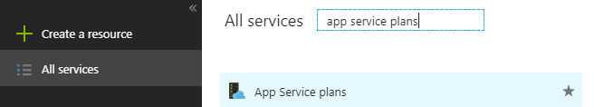
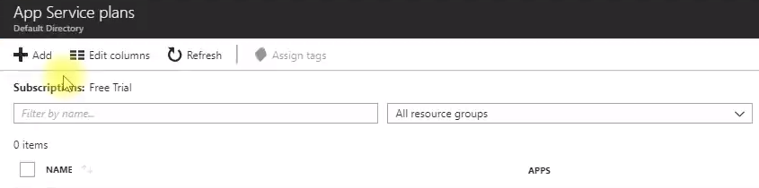
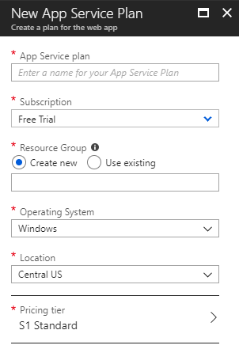

# EP 23-01 Azure App Service Plan

ที่เว็บ [Microsoft Azure](https://portal.azure.com/) เมื่อทำการ Login เรียบร้อยแล้ว ให้คลิ๊กที่ เมนู All services ด้านซ้าย แล้วค้นหา App Service Plan แล้วคลิ๊กเข้าไป

คลิ๊กที่ +Add เพื่อสร้าง App Service Plan

กรอกข้อมูลต่างๆ 

สำหรับ Pricing tier เป็นการเลือกว่าจะเลือก Plan แบบไหน ซึ่ง Plan แต่ละแบบเป็นยังไงเราสามารถดูรายละเอียดได้ที่ [App Service pricing](https://azure.microsoft.com/en-us/pricing/details/app-service/windows/) เมื่อเลือก Plan ที่ต้องการแล้ว คลิ๊ก Apply และ Create รอให้ระบบทำงานสักครู่ เราก็จะได้ App Service Plan เพื่อไปทำงานต่อได้

* * *

### VDO Link

UnlockingTFC