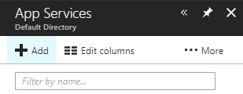
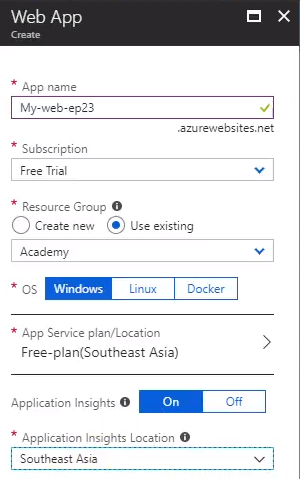
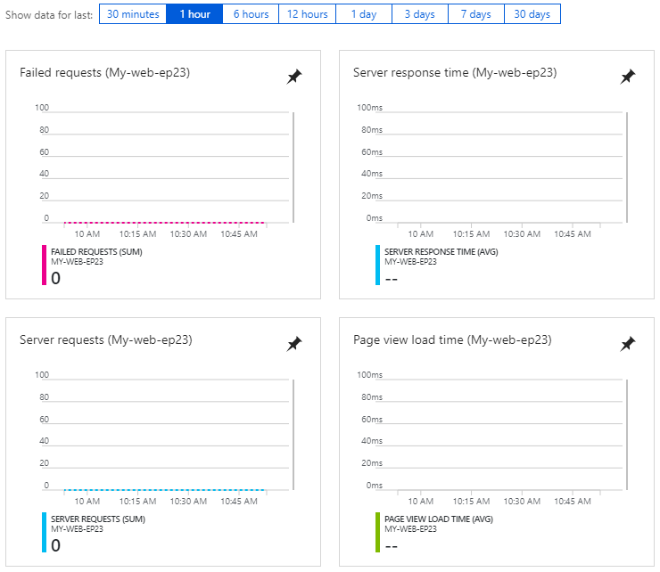

# EP 23-02 Azure web app + app insight

### สร้าง web app 

สร้าง web app เพื่อใช้ในการ pubish web ที่อยู่ใน Local ของเราให้ไปเป็น online 

ในเว็บ [Microsoft Azure](https://portal.azure.com/) ให้คลิ๊กเข้าไปที่ App Services

  

แล้วคลิ๊ก +Add

  

จากนั้นเลือก Web App

จากนั้นคลิ๊ก Create แล้วกรอกข้อมูล

เมื่อกรอกข้อมูลเรียบร้อยแล้วคลิ๊ก Create

### app insight

app insight คือ บริการเสริมที่ใช้ในการตรวจสอบการทำงานของ web เช่น มี Failed requests, Server response time, Server requests, Page view load time เท่าไหร่ 

* * *

### VDO Link

UnlockingTFC