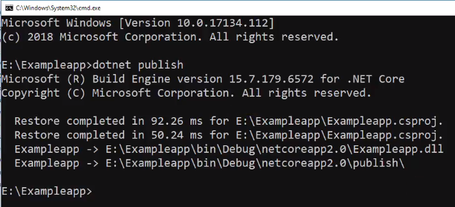
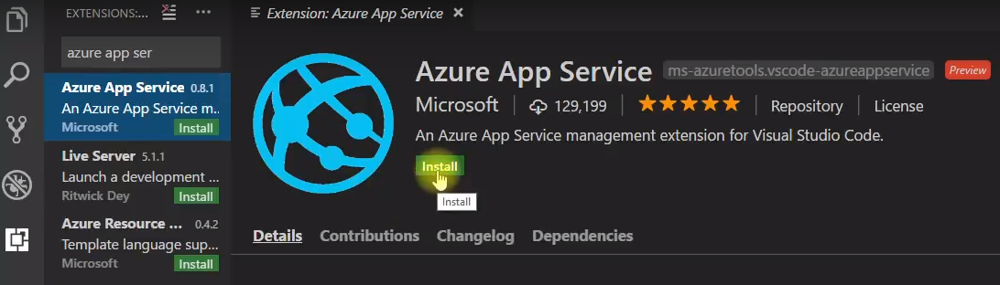
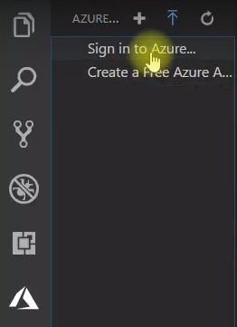
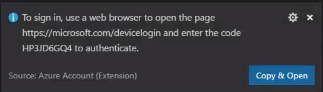
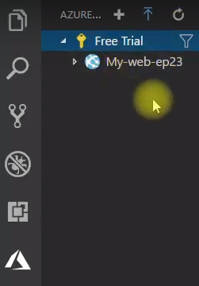
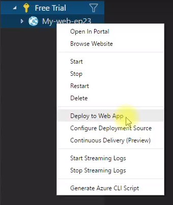
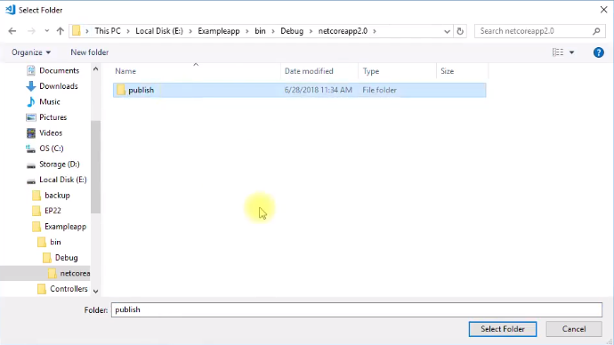
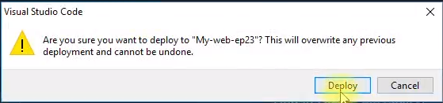
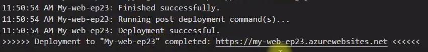

# EP 23-03 Pubish และ Deploy Azure web app จาก VS Code

เปิด CMD เข้าไปที่ directory ของเว็บ จากนั้นใช้คำสั่ง `dotnet pubish` จะได้ไฟล์สำหรับในการใช้ pubish

ใน VS Code จะต้องทำการติดตั้ง Extension ที่ชื่อ Azure App Service วิธีการติดตั้งคือคลิ๊กที่แถบ Extension แล้วค้นหา Azure App Service แล้วคลิ๊ก install รอให้ติดตั้ง Extension เสร็จจากนั้นคลิ๊ก Reload

เมื่อติดตั้ง Extension เสร็จ จะมีแถบเมนูของ Azure เพิ่มขึ้นมา ในแถบเมนู Azure คลิ๊ก Sign in to Azure 

จะมี PopUp เด้งขึ้นมาว่าให้เราเอา รหัส ไปใส่ในเว็บ [Microsoft](https://login.microsoftonline.com/common/oauth2/deviceauth) 

คลิ๊ก Copy & Open VS Code จะ Copy รหัส และเปิดเว็บให้ จากนั้นเอารหัสไปวาง แล้วคลิ๊ก Continue แล้วเลือก Account ที่ต้องการ 

กลับมาที่ VS Code จะเห็นได้ว่ามี Subscription และ Web App เพิ่มเข้ามา  

  

คลิ๊กขวาที่ web app แล้วเลือก Deploy to Web App

จากนั้นคลิ๊ก Browse แล้วเลือก directory ของไฟล์ที่ใช้สำหรับการ pubish

คลิ๊ก Deploy เพื่อยืนยันการ pubish  

เมื่อระบบทำงานเรียบร้อยเราก็จะได้เว็บที่อยู่บน server สามารถเข้าไปในเว็บได้ตาม URL

* * * 

### VDO Link

UnlockingTFC