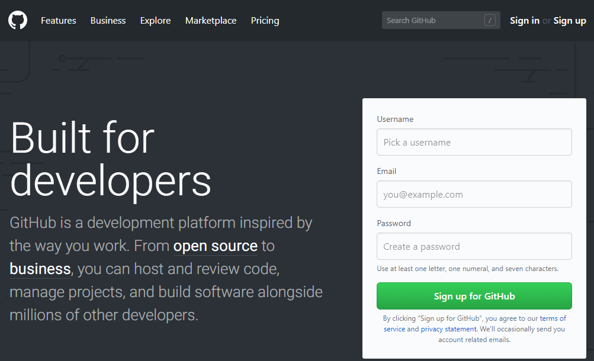
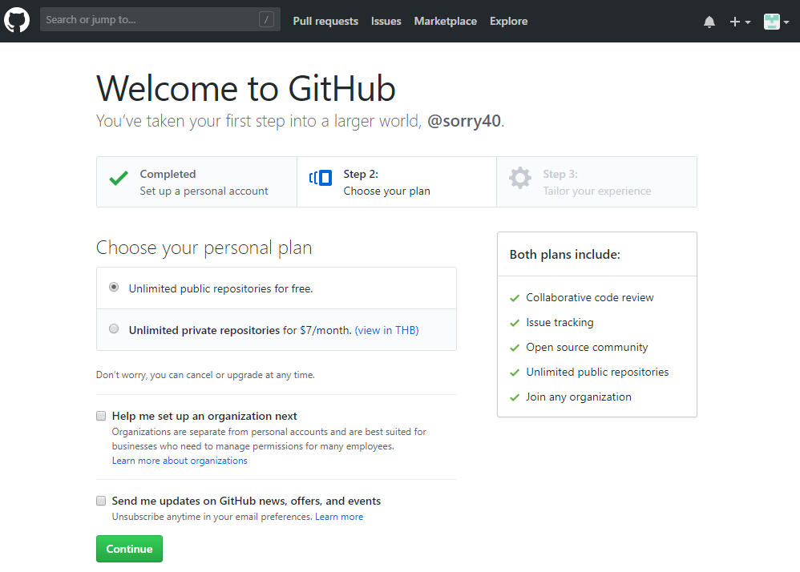
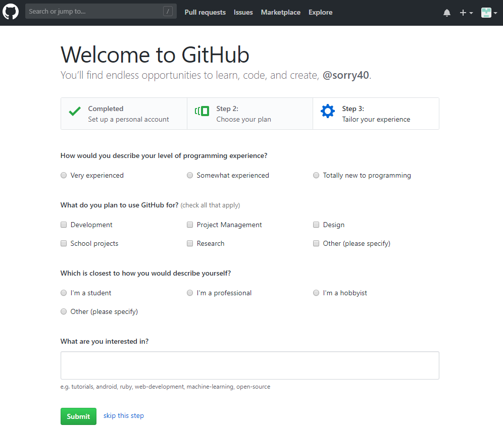
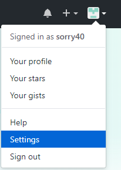
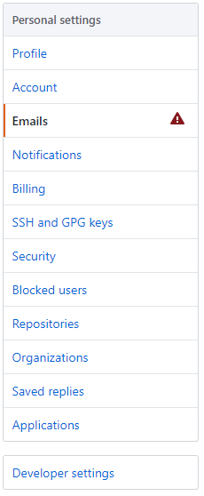
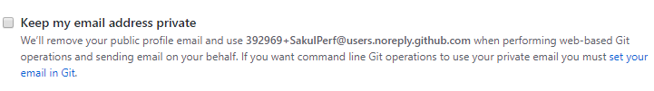

# EP 24-02 สมัคร Account Github.com

GitHub คือ website Git (version control repository) ที่อยู่บน internet มีการทำงานแบบเดียวกับ Git เลย แต่สามารถเข้าถึงข้อมูลและจัดการไปผ่าน web โดยไม่ต้องเสียเงิน หรือลงทุกตั้ง server เพื่อติดตั้ง Git เองเลย แต่ code project ทั้งหมดจะุถูกแจกจ่ายให้คนอื่นๆสามารถเห็นได้ด้วย ซึ่ง GitHub ก็มีการเสนอ plan แบบส่วนตัวให้ถ้าอยากให้ code ไม่ถูกแจกจ่ายออกไปโดยจะมีค่าใช้จ่ายตรงนี้ ปัจจุบันมีมากกว่า 20 ล้าน user รวมกันกว่า 60 ล้าน repository บนระบบแล้ว

### Sign up GitHub

เข้าไปที่เว็บ [Github](https://github.com/) แล้วกรอกข้อมูล Username, email, password จากนั้น คลิ๊ก Sign up for Github

ขั้นตอนต่อไปเว็บ Github จะให้เราเลือกว่า จะให้ Plan แบบไหน ซึ่งจะมีแบบ Public ทุกคนสามารถเห็นอะไรต่างๆ ที่เราอัพขึ้น Github ได้ และแบบ Private คนอื่นจะไม่เห็นแต่มีค่าใช้จ่าย

เมื่อเลือก Plan เรียบร้อยแล้ว Github จะถามข้อมูลเรานิดหน่อยเช่น ประสบการณ์ด้าน programming, จะใช้ Github ทำอะไร, สถานะภาพเราเป็นแบบไหน, สนใจอะไร

เมื่อกรอกข้อมูลต่างๆ เรียบร้อยเราก็ได้ Account ของ Github มา

จากนั้น Github จะส่ง Email มาให้ ให้เราเข้าไปทำการ Verification email ให้เรียบร้อย

* * *

### Open email ใน Github

เนื่องจากระบบส่งการบ้านในคอร์ส Unlocking the Future Code จะส่งผลการตรวจการบ้านผ่าน email ที่ใช้ สมัคร Github ดังนั้น จึงต้องตั้งค่า ให้ผู้อื่นสามารถเห็น email ของเราได้ 

#### วิธีตั้งค่า Public Email 

คลิ๊กที่ไอคอนโปรไฟล์ ด้านบนขวาแล้วเลือก Settings  

  

จากนั้นเลือกเมนู Emails  

ในช่อง ต้องไม่ ติ๊ก ตามรูป 

* * *

### VDO Link
