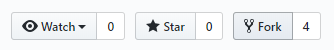
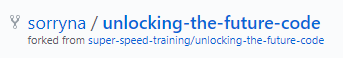
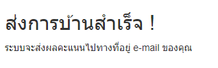

# EP24-03 Fork Repositories

เมื่อเรามี Account Github เรียบร้อยแล้ว เราสามารถเข้าไปค้นหา Repositories ที่ต้องการได้ 

 

เมื่อเราเจอ Repositories ที่เราต้องการ เราจะสามารถเข้าไปดูว่า ข้างใน Repositories นั้น มีไฟล์อะไรอยู่บ้าง ไฟล์ข้างในมีข้อมูลเป็นอย่างไร แล้วยังสามารถ Clone ไฟล์จาก Repositories มาไว้ที่เครื่องคอมพิวเตอร์ของเรา เพื่อแก้ไข เพิ่มเติม ไฟล์หรือข้อมูลต่างๆ แต่เราไม่มาสามารถ Push ข้อมูลหรือไฟล์ที่แก้ไขแล้วเข้าไปใน Repositories ของคนอื่นได้(เจ้าของ Repositories ต้อง invite ก่อนถึงจะ Push ได้) ดังนั้นจึงต้องทำการ Fork Repositories ที่ต้องการมาเป็นของเราเองก่อน ถึงจะทำการ Push ข้อมูลหรือไฟล์ที่แก้ไขแล้วเข้าไปได้

โดยการคลิ๊ก Fork แล้ว Github จะถามว่าให้ Fork ไปที่ Account ไหน แล้วก็จะได้ Repositories นั้นมาเป็นของเรา

### วิธีส่ง การบ้าน Unlocking the Future Code

เมื่อ Fork Repositories ที่เป็นการบ้านมาแล้ว ก็ Clone Repositories ที่เป็นของเราลงเครื่องคอมพิวเตอร์ จากนั้นแก้ไข เพิ่มเติม Code ให้เรียบร้อย แล้ว Push ไฟล์ไปที่ Repositories บน Github แล้วเอา Url Github Repositories มาใส่ที่เว็บ [ส่งการบ้าน](https://tinyurl.com/yam56y43)  
แล้วระบบจะส่งการการตรวจการบ้านกลับไปที่ Email ที่ใช้สมัคร Github

Link ส่งการบ้าน  
[https://tinyurl.com/yam56y43](https://tinyurl.com/yam56y43)  
[https://unlocking-homework.azurewebsites.net/](https://unlocking-homework.azurewebsites.net/)

* * *

### VDO Link

๊ืUnlockingTFC